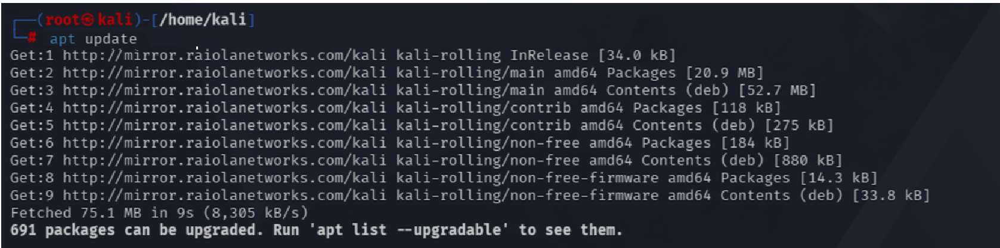
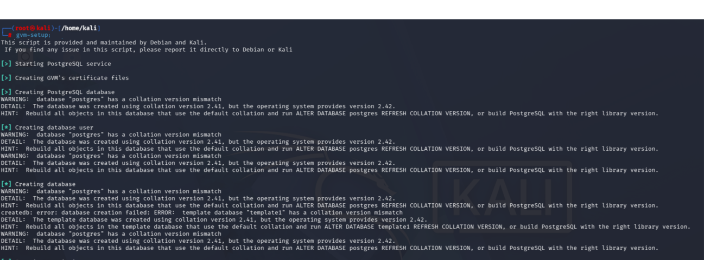
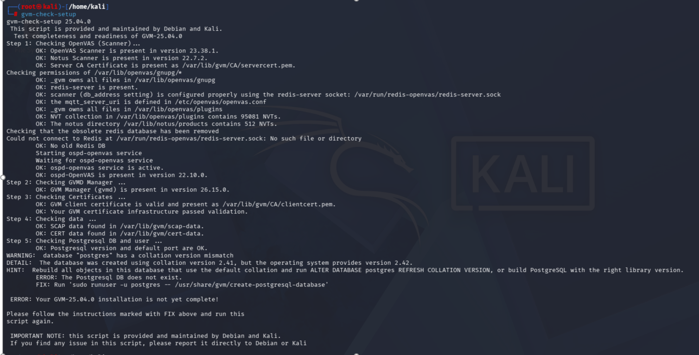
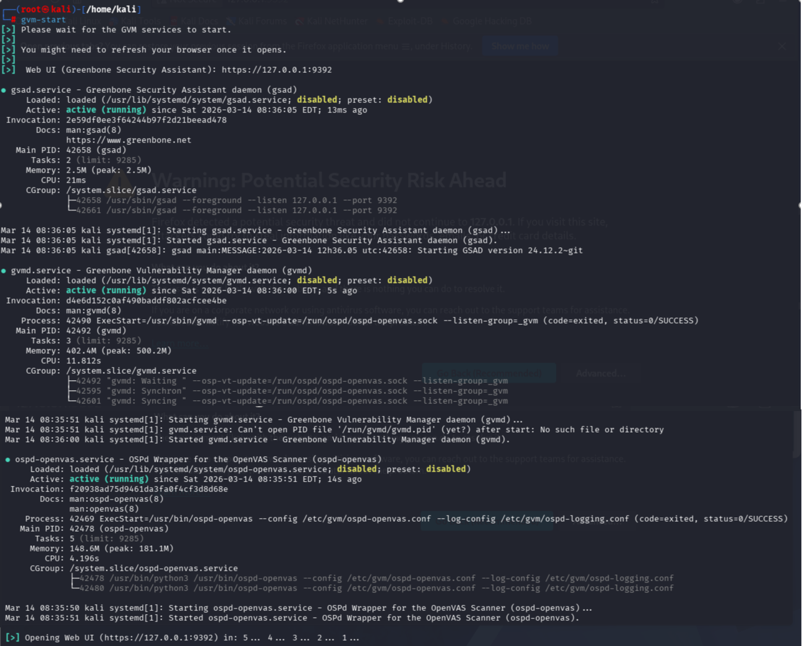
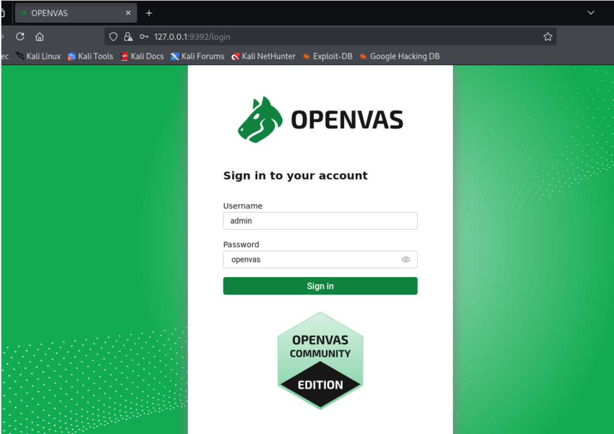

# OpenVAS Installation Guide

## Supported Operating Systems

  As mentioned in the [Overview](01-openvas-overview.md) section although there are     workarounds to run OpenVAS from a Windows environment, such as using virtual          machines or similar solutions, the tool is designed to run natively on Linux          systems. OpenVAS can be installed directly on several Linux distributions. The most   commonly   used ones are:
  
    - Kali Linux
    - Ubuntu / Debian
    - Parrot OS
    
  These distributions provide the necessary dependencies and package repositories       required to install and run the Greenbone Vulnerability Management components.

**Configuration note:**  
All commands used during this process require administrator privileges. In the screenshots provided, the Kali Linux session already has administrative permissions, so the `sudo` prefix is not displayed.

## 1. Update Package List

````markdown
kali@kali:~$ sudo apt update
````

This command updates the list of available packages on the system.The system queries the Linux repositories and downloads the most recent list of available software.
This command does not install any software yet, but ensures that the latest versions of packages are available before installing new software.

<p align="center">
  
  <br>
  <em>Update Package List</em>
</p>

## 2. Install Greenbone Vulnerability Manager (GVM)

````markdown
kali@kali:~$ sudo apt install gvm
````

This command installs the Greenbone Vulnerability Management framework, which includes:

    - OpenVAS Scanner
    - Greenbone Vulnerability Manager (gvmd) 
    - Greenbone Security Assistant (web interface)
    - Vulnerability test plugins (VTs)
  
All required dependencies are automatically installed during this process.

<p align="center">
  
  <br>
  <em>OpenVAS installation process</em>
</p>

## 3. Initial Setup

````markdown
kali@kali:~$ sudo gvm-setup
````

This command performs the initial configuration of the platform.During this process the system will:

    - download the vulnerability test feed
    - configure the scanning engine
    - initialize the PostgreSQL database
    - generate SSL certificates
    - create the administrator account

This step may take several minutes depending on system performance and insternet speed.

<p align="center">
  
  <br>
  <em>OpenVAS Setup</em>
</p>


## 4. Verify Installation

````markdown
kali@kali:~$ sudo gvm-check-setup
````

This command verifies that all required components have been correctly installed and configured.It checks:

    - vulnerability feeds
    - scanner configuration
    - database setup
    - system dependencies

<p align="center">
  
  <br>
  <em>OpenVAS check setup</em>
</p>

In this case, the command indicates that the installation has been completed successfully. However, in our situation, this result was obtained after performing several prior actions to resolve specific issues that occurred during the setup process. These steps can be found in [OpenVAS Installation > Setup Check Issue](06-troubleshooting.md) section.

When the tool detects a problem during installation, it returns the corresponding error message and suggests possible actions to resolve it.

## 5. Star the Services

````markdown
kali@kali:~$ sudo gvm-start
````

This command starts all services required for the vulnerability management platform.This command starts all services required for the vulnerability management platform.

<p align="center">
  
  <br>
  <em>OpenVAS Start</em>
</p>

## 6. Access the Web Interface
After completing step 5, the web interface of the platform can be accessed through a web browser at:

https://127.0.0.1:9392

The credentials generated during the setup process are used to log in to the web interface.

<p align="center">
  
  <br>
  <em>OpenVAS Web and Credentials</em>
</p>
 
This interface provides access to the Greenbone Security Assistant, where users can configure and manage different components of the vulnerability management platform, including targets, scan tasks, vulnerability reports, and system configuration.These elements and their functionality will be explored in greater detail in the [Vulnerability Scan](03-lab-setup.md) section. section.


