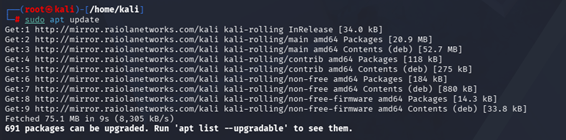
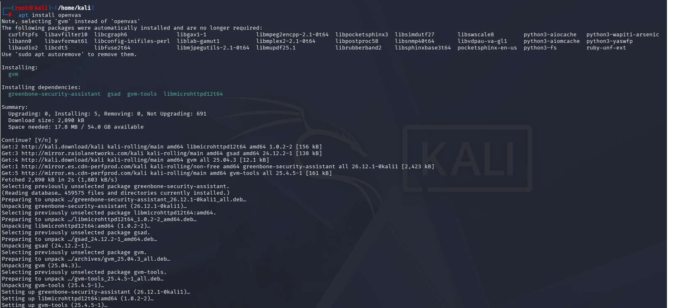
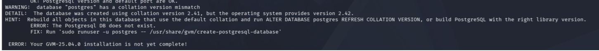
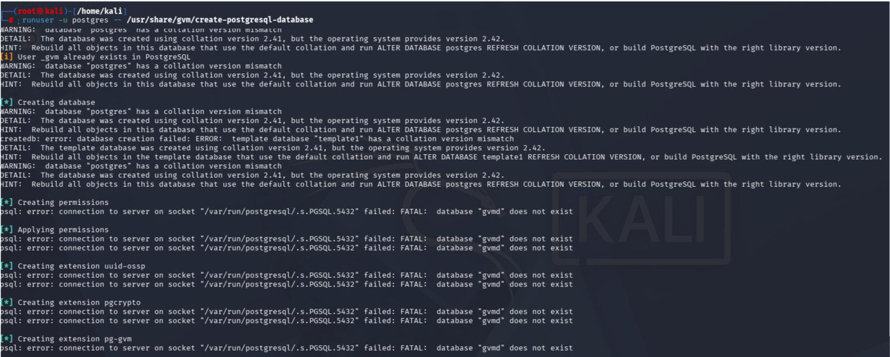
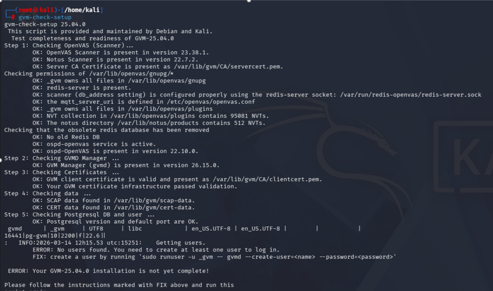
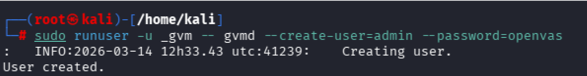

# OpenVAS Installation Guide

## Supported Operating Systems

  As mentioned in the [Overview](01-openvas-overview.md) section although there are     workarounds to run OpenVAS from a Windows environment, such as using virtual          machines or similar solutions, the tool is designed to run natively on Linux          systems. OpenVAS can be installed directly on several Linux distributions. The most   commonly   used ones are:
  
    - Kali Linux
    - Ubuntu / Debian
    - Parrot OS
    
  These distributions provide the necessary dependencies and package repositories       required to install and run the Greenbone Vulnerability Management components.

## 1. Update Package List

````markdown
kali@kali:~$ sudo apt update
````

This command updates the list of available packages on the system.The system queries the Linux repositories and downloads the most recent list of available software.
This command does not install any software yet, but ensures that the latest versions of packages are available before installing new software.

<p align="center">
  
  <br>
  <em>Update Package List</em>
</p>

## 2. Install Greenbone Vulnerability Manager (GVM)

````markdown
kali@kali:~$ sudo apt install gvm
````

This command installs the Greenbone Vulnerability Management framework, which includes:

    - OpenVAS Scanner
    - Greenbone Vulnerability Manager (gvmd) 
    - Greenbone Security Assistant (web interface)
    - Vulnerability test plugins (VTs)
  
All required dependencies are automatically installed during this process.

<p align="center">
  
  <br>
  <em>OpenVAS installation process</em>
</p>

## 3. Initial Setup

````markdown
kali@kali:~$ sudo gvm-setup
````

This command performs the initial configuration of the platform.During this process the system will:

    - download the vulnerability test feed
    - configure the scanning engine
    - initialize the PostgreSQL database
    - generate SSL certificates
    - create the administrator account

This step may take several minutes depending on system performance and insternet speed.

<p align="center">
  
  <br>
  <em>OpenVAS installation process</em>
</p>


## 4. Verify Installation

````markdown
kali@kali:~$ sudo gvm-check-setup
````

This command verifies that all required components have been correctly installed and configured.It checks:

    - vulnerability feeds
    - scanner configuration
    - database setup
    - system dependencies

<p align="center">
  
  <br>
  <em>OpenVAS check setup</em>
</p>

If any issue is detected, the tool provides recommendations on how to resolve it.  
In our case, two issues were identified:

1. A problem related to PostgreSQL where the database was reported as **"does not exist"**. 
<p align="center">
  
  <br>
  <em>OpenVAS check setup</em>
</p>

The suggested solution was to recreate or initialize the PostgreSQL database used by GVM.
````markdown
kali@kali:~$ sudo runuser -u postgres -- /usr/share/gvm/create-postgresql-database
````
<p align="center">
  
  <br>
  <em>OpenVAS check setup</em>
</p>

2. The absence of a user account required to access the web interface.

<p align="center">
  
  <br>
  <em>OpenVAS check setup</em>
</p>
In this case, it is necessary to create an administrator user in order to log in to the platform.
````markdown
kali@kali:~$ sudo runuser -u _gvm -- gvmd --creat-user=admin --password=openvas
````
<p align="center">
  
  <br>
  <em>OpenVAS check setup</em>
</p>
