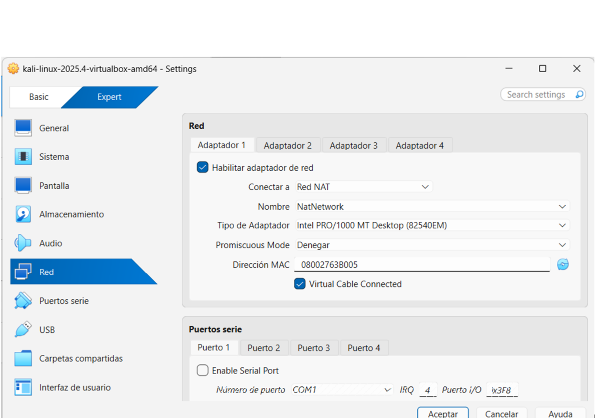
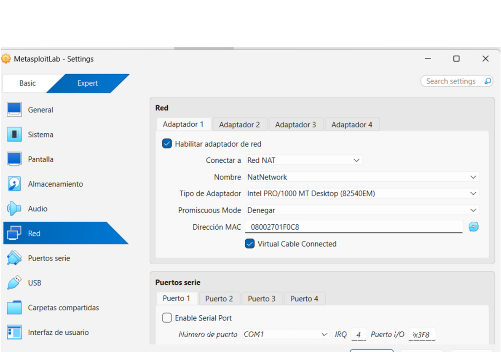
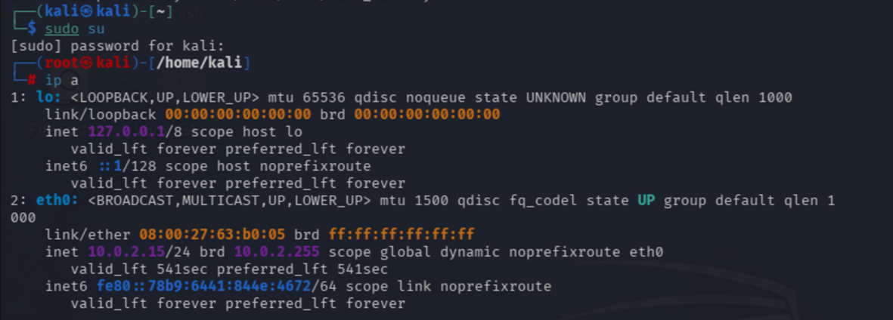
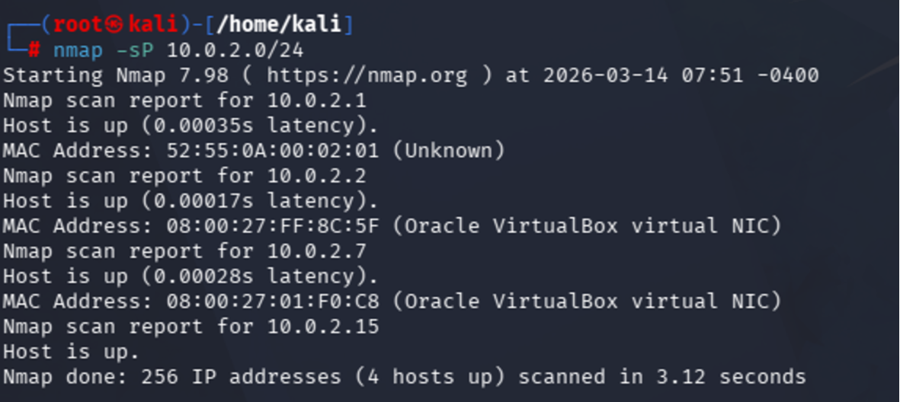
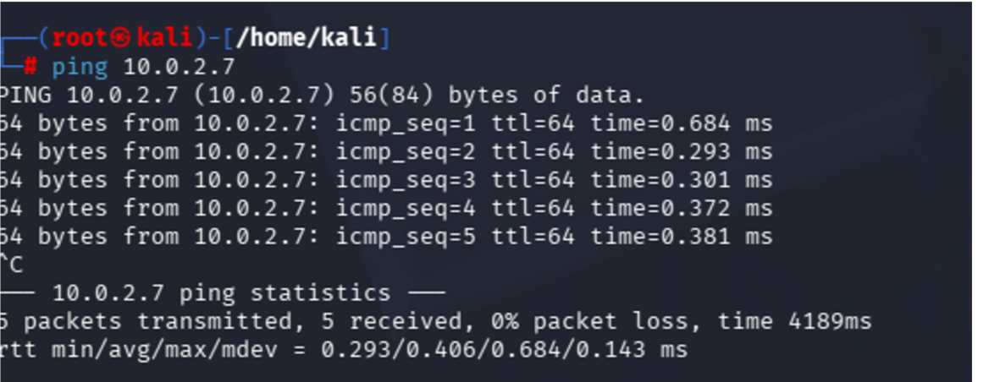

# Lab Setup
The purpose of this laboratory is to demonstrate how a vulnerability scanner can identify security weaknesses in a vulnerable system. The goal of the lab is to perform a vulnerability scan against the Metasploitable system using OpenVAS.

## 1. Machines Used in the Lab

  ### Scanner Machine

- Operating System: Kali Linux
- Network configuration: NAT Network (VirtualBox)
- Tool: OpenVAS / Greenbone Vulnerability Manager
- Role: Vulnerability scanner

  
   
  <em>Kali Network Configurationt</em>

  ### Target Machine

- Operating System: Metasploitable 2
- Network configuration: NAT Network (VirtualBox)
- Role: Vulnerable target system used for security testing

Metasploitable is an intentionally vulnerable virtual machine designed for security training and penetration testing exercises. Instructions for downloading and configuring the Metasploitable2 machine can be found in the [Lab Setup > Metasploitable2 Installation and Configuration](07-troubleshooting.md) section.

  
   
  <em>Metasploitable2 Network Configurationt</em>

## 2. Laboratory Environment

The laboratory environment consists of two virtual machines connected to the same network. Both machines are configured within the same **NAT Network in VirtualBox**, enabling communication between the vulnerability scanner and the target system.

- **Kali Linux**: attacker machine used to install and run OpenVAS.
- **Metasploitable 2**: intentionally vulnerable machine used as the scan target.

  
   
  <em>Laboratory Diagram</em>

## 3.  Network Verification

Before starting the vulnerability scan, it is necessary to identify the IP address assigned to the target virtual machine within the network. This can be done using standard network commands such as `ip a` or `ifconfig` on each machine. However, in this case, the Nmap host discovery function will be used to identify active hosts in the network, simulating a real-world environment.

  
   
  <em>Kali IP</em>

  
   
  <em>Nmap Discovery Function</em>

  
   
  <em>Comunication Check</em>
</p

 At this point, the environment is ready and the vulnerability scan can be configured.
