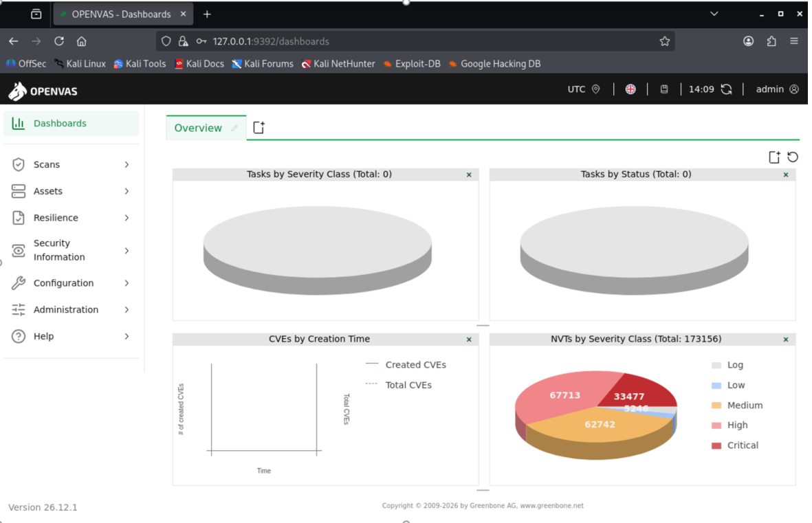
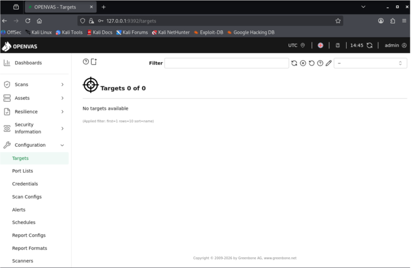
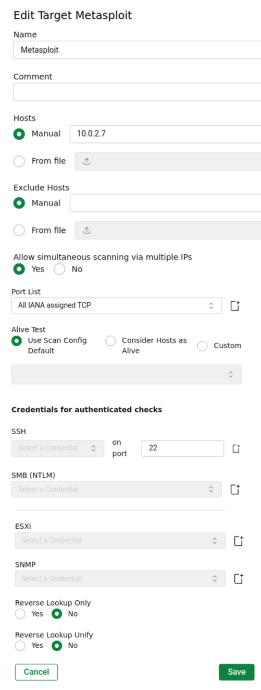
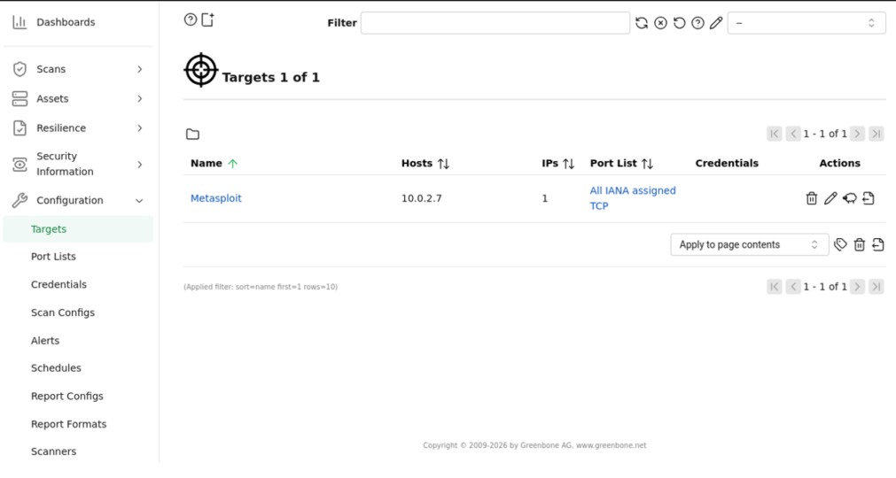
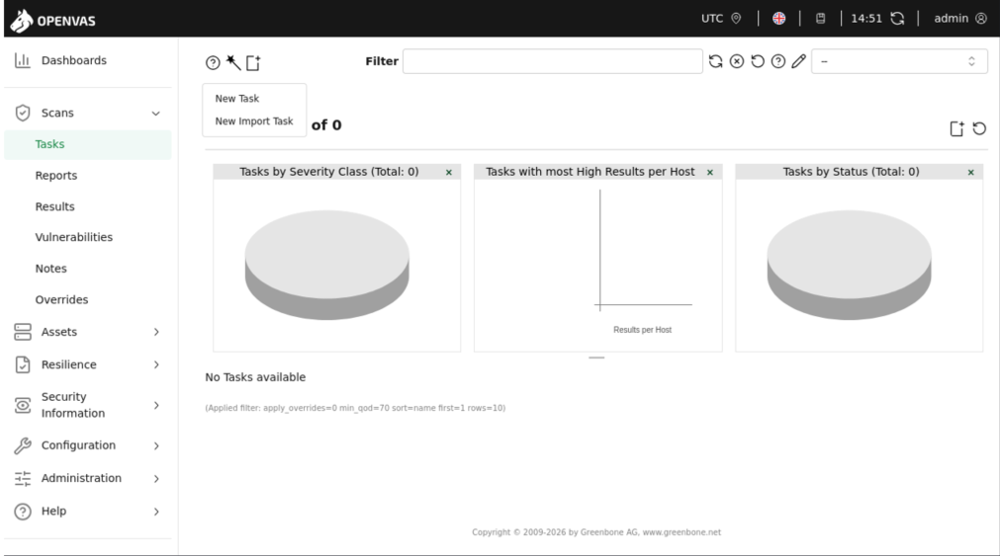
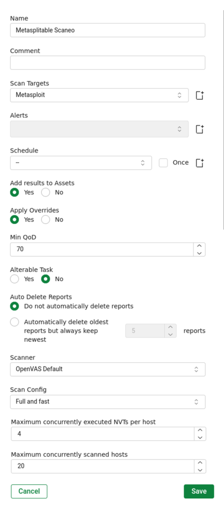
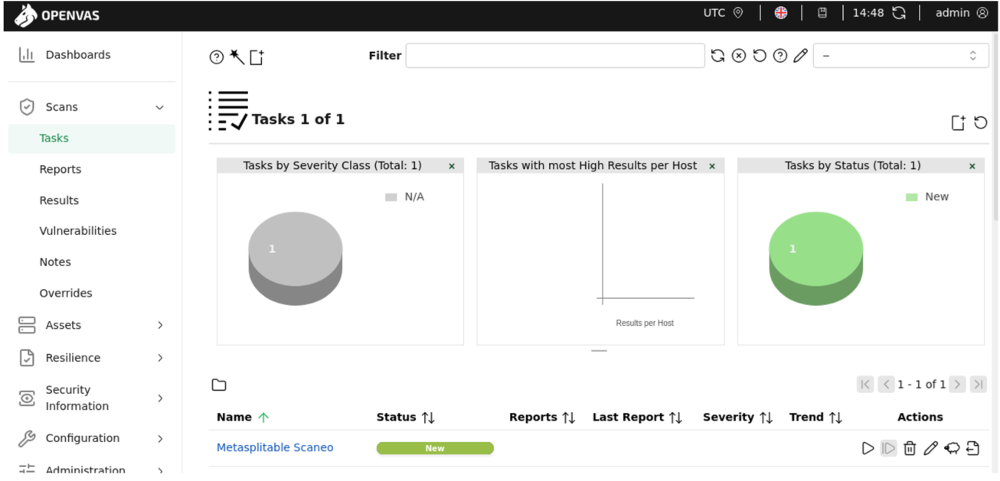
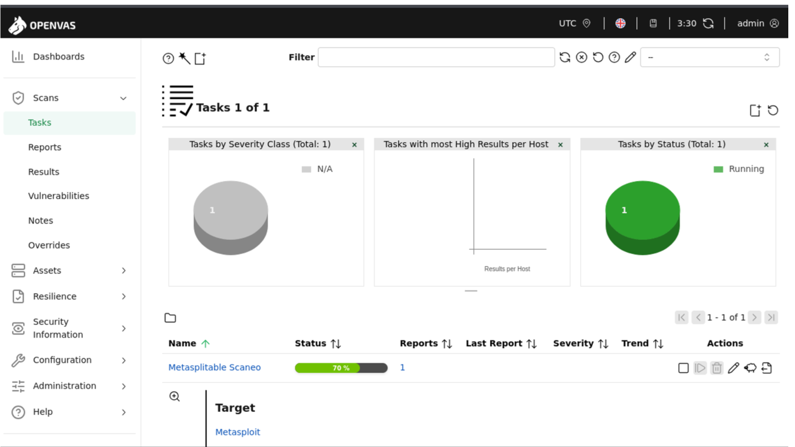
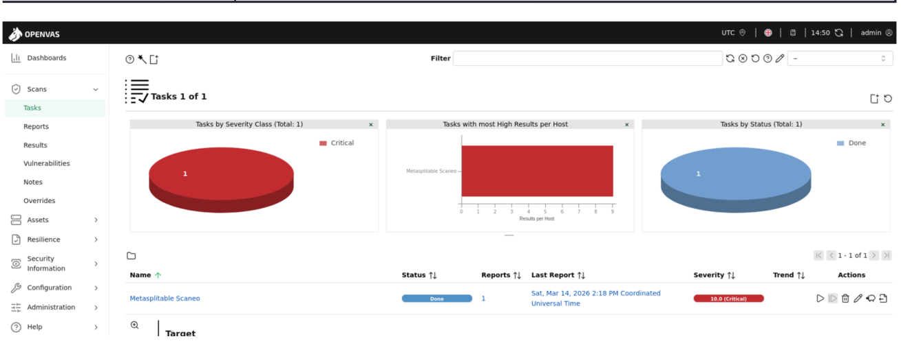

# Vulnerability Scan Configuration

Once the laboratory environment has been prepared and network connectivity between the scanner and the target system has been verified, the next step is to configure and execute the vulnerability scan using OpenVAS. The following screenshot shows the dashboard view displayed upon first access.

  
   
  <em>OpenVAS Dashboard</em>

## 1. Target Configuration

The first step is to define the scan target within the OpenVAS web interface.

1. Navigate to **Configuration → Targets**
2. Click **New Target** 

  

3. Provide the following information:

- **Name:** Metasploitable2
- **Hosts:** 10.0.2.7
- **Port List:** Default

  

This configuration defines the system that will be analyzed by the vulnerability scanner. Once the scan target has been successfully created, it will appear on the main screen as shown in the following screenshot. 

  

It is possible that at this stage some issues related to the target creation may occur. If this happens, please refer to the [Scan Configuration > Feed Owner Issue](06-troubleshooting.md) section to review how a problem related to the feed owner was identified and resolved.

---

## 2. Scan Task Configuration

After defining the target, a scan task must be created.

1. Navigate to **Scans → Tasks**
2. Click **New Task**

  

3. Configure the task with the following parameters:

- **Name:** Metasploitable Scaneo
- **Scan Target:** Metasploit
- **Scan Config:** Full and Fast

The **Full and Fast** configuration performs a comprehensive vulnerability assessment while maintaining reasonable scanning time.

  

Once the scan  has been successfully created, it will appear on the main screen as shown in the following screenshot. 

  

---

## 3. Launching the Scan

Once the task has been created, the scan can be executed by clicking the **Start Scan** button.
During this phase, OpenVAS performs several actions:

  - host discovery
  - port scanning
  - service detection
  - vulnerability testing using its vulnerability test database

The duration of the scan will depend on the number of detected services and the complexity of the target system.

  

Once the scan is completed, the results will appear as shown below.

  

---

