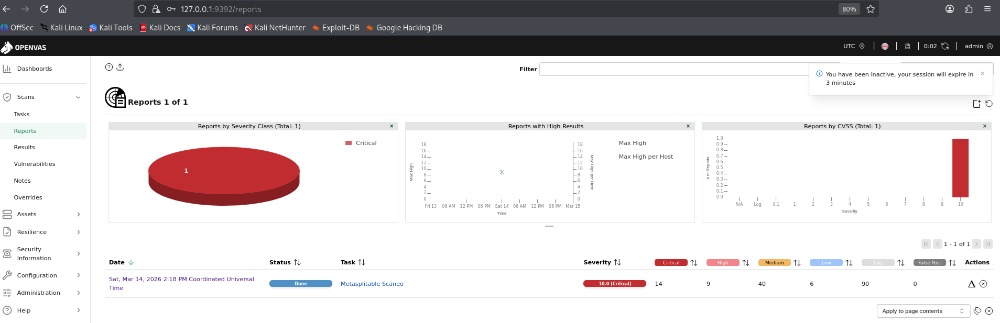
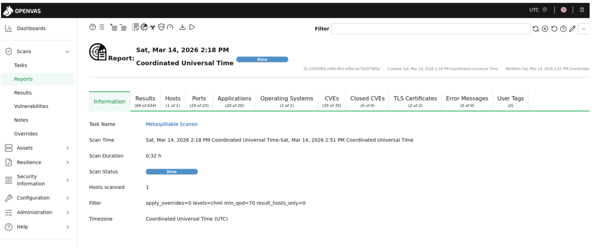
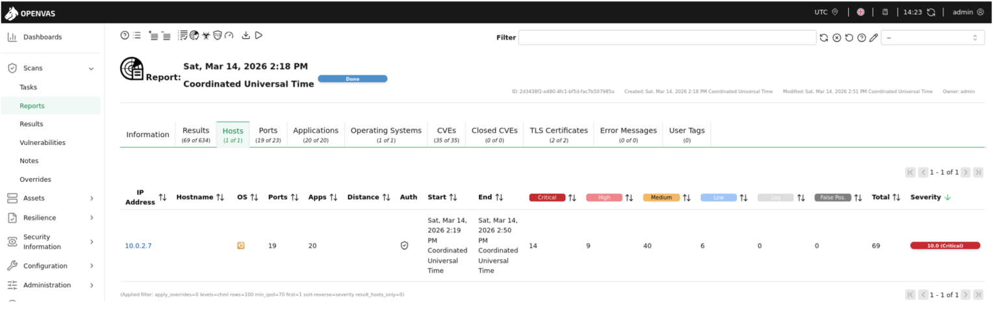
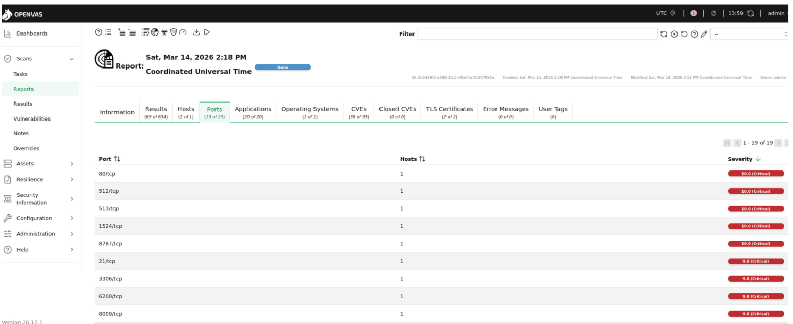
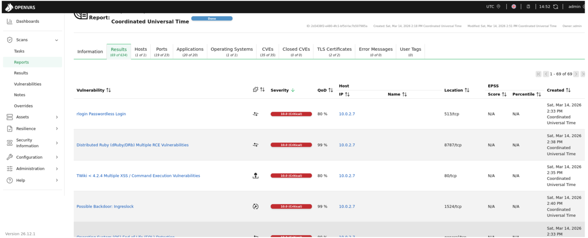

# Vulnerability Scan Results Analysis

Once the vulnerability scan has completed, OpenVAS generates a detailed report that allows security analysts to review the findings and identify potential security risks in the target system.

To view the generated report, navigate to Scans > Reports and select the report that has been created:

  
   
    <em> OpenVas Report</em>

The report provides different views that help understand the results from several perspectives, including:

    - scan overview
    - scanned hosts
    - detected ports and services
    - identified applications
    - detected vulnerabilities
    - detailed vulnerability information

The following sections describe how to interpret these results.

## 1. Scan Overview

The **Information** tab provides a global summary of the executed scan.

This section contains general information about the scan task, including:

      - task name
      - scan start time
      - scan end time
      - scan duration
      - number of hosts scanned
      - scan status

This information confirms that the vulnerability assessment was executed successfully and provides context about the scope of the scan.

  
   
    <em> Scan Global Information</em>

 ## 2. Host Analysis

The **Hosts** tab displays the systems that were scanned during the assessment. For each host, OpenVAS provides several relevant metrics, including:
    - IP address
    - number of open ports detected
    - number of identified applications
    - number of vulnerabilities categorized by severity

In this laboratory environment, the scan targeted a single host **Metasploitable** (10.0.2.7).The report shows that multiple vulnerabilities were identified across several services running on this system.

  
   
  <em>Host Information</em>

## 3. Port Analysis

The **Ports** tab displays the network services discovered during the vulnerability scan.This view allows analysts to quickly identify which network services are exposed and evaluate the potential attack surface of the system.Each entry includes:

    - the port number
    - the associated protocol
    - the host where the service is running
    - the severity level of vulnerabilities related to that service

In the analyzed system, several ports are identified as **Critical**, indicating the presence of vulnerabilities that could allow attackers to compromise the system.Examples of exposed services include:

- **21/tcp – FTP**
- **80/tcp – HTTP**
- **3306/tcp – MySQL**
- **8787/tcp – Distributed Ruby (DRb)**

The presence of multiple exposed services significantly increases the attack surface of the system.

  
   
  <em>Port Information</em>

## 4. Vulnerability List

The **Results** tab contains the complete list of vulnerabilities identified during the scan. Each vulnerability entry includes several attributes that help security analysts understand the risk associated with the finding.
These attributes include:

    - vulnerability name
    - severity level
    - host IP address
    - affected port
    - Quality of Detection (QoD)

Severity levels are determined using the **CVSS scoring system**, which helps prioritize remediation actions. Several critical vulnerabilities were detected during the scan of the Metasploitable2 system. Examples include:

- **rlogin Passwordless Login**
- **Distributed Ruby (dRuby/DRb) Multiple RCE Vulnerabilities**
- **TWiki Multiple XSS / Command Execution Vulnerabilities**
- **Possible Backdoor: ingreslock**

These vulnerabilities demonstrate that the system contains multiple insecure services that could be exploited by an attacker.

  
   
  <em>Vulnerability Information</em>

In [Lab Setup > Metasploitable2 Installation and Configuration](06-cve-2011-2523-vulnerability-analysis.md) section., we take a deeper look at one of the vulnerabilities identified during the OpenVAS scan.
