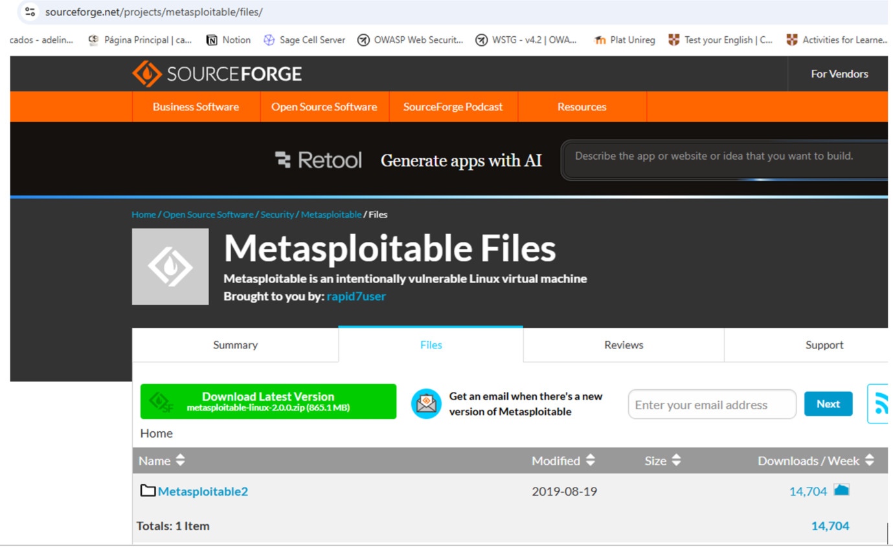
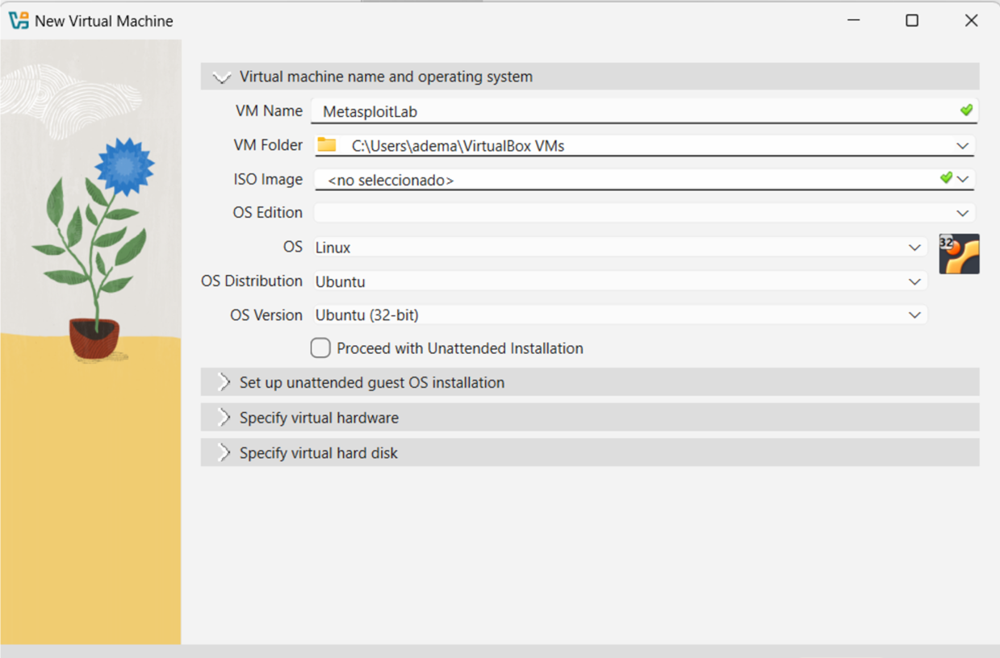
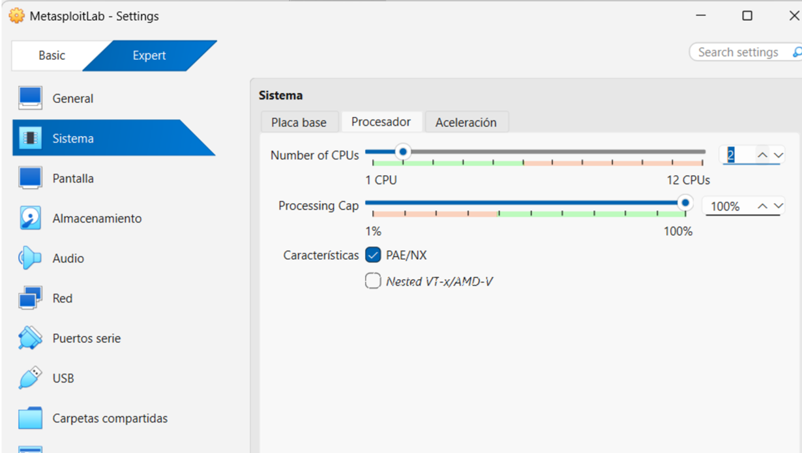
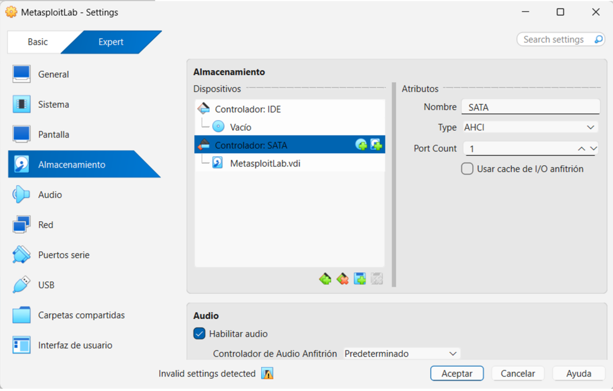
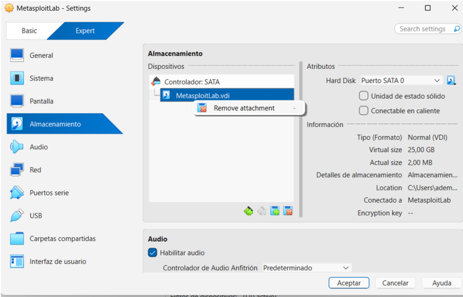
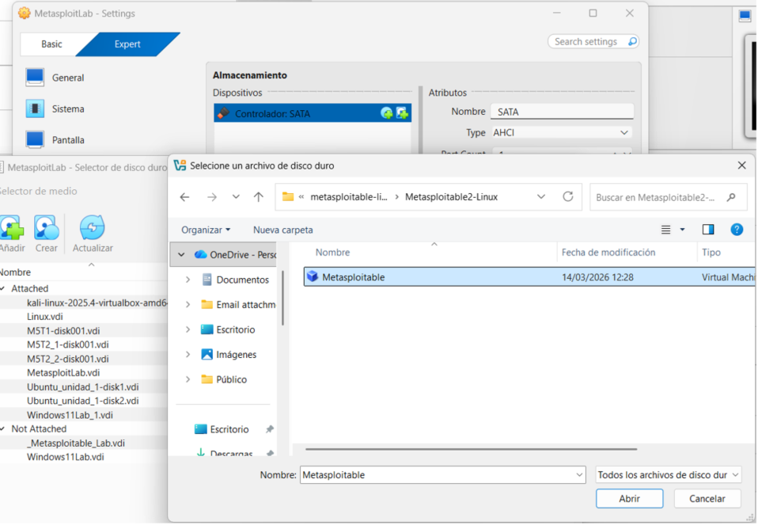

# OpenVAS Installation > Setup Check Issue
When running gvm-check-setup, if any issue is detected, the tool provides recommendations on how to resolve it. In our case, two issues were identified:  

1. A problem related to PostgreSQL where the database was reported as **"does not exist"**. 
<p align="center">
  
  <br>
  <em>OpenVAS check setup</em>
</p>


  The suggested solution was to recreate or initialize the PostgreSQL database used by GVM.
    
````markdown
kali@kali:~$ sudo runuser -u postgres -- /usr/share/gvm/create-postgresql-database
````
<p align="center">
  
  <br>
  <em>OpenVAS check setup</em>
</p>

2. The absence of a user account required to access the web interface.

<p align="center">
  
  <br>
  <em>OpenVAS check setup</em>
</p>

  In this case, it is necessary to create an administrator user in order to log in to the platform.

````markdown
kali@kali:~$ sudo runuser -u _gvm -- gvmd --creat-user=admin --password=openvas
````

<p align="center">
  
  <br>
  <em>OpenVAS check setup</em>
</p>

For additional issues, please refer to the [official documentation](https://greenbone.github.io/docs/latest/22.4/kali/troubleshooting.html).

-----

# Lab Setup > Metasploitable2 Installation and Configuration
Metasploitable is an intentionally vulnerable Linux virtual machine. This VM can be used to conduct security training, test security tools, and practice common penetration testing techniques. 
1. First, we download the Metasploitable2 virtual machine from the SourceForge website. The URL is https://sourceforge.net/projects/metasploitable/files/Metasploitable2/
The default login and password is msfadmin:msfadmin.

<p align="center">
  
  <br>
</p>

2. In VirtualBox, we create a new virtual machine with the following configuration:

- **VM Name:** MetasploitLab  
- **OS:** Linux  
- **OS Distribution:** Ubuntu
- **OS Version:** Ubuntu (32-bit)

<p align="center">
  
  <br>
</p


3. Once the virtual machine has been created, we go to **Settings** and review the default configuration.  
First, we modify the number of CPUs and set it to **2**.

<p align="center">
  
  <br>
</p

4. Next, we review the Storage configuration, which determines the device from which the virtual machine will boot. As shown in the image, the system currently includes two storage controllers: an IDE controller with an empty optical drive and a SATA controller containing the virtual disk file MetasploitLab.vdi.

<p align="center">
  
  <br>
</p


This configuration will not work correctly for our lab because Metasploitable2 is distributed as a preconfigured virtual disk in .vmdk format, not as a .vdi disk created during the VM wizard. Therefore, the machine will not boot into the intended vulnerable environment.

To correct this configuration, we first remove the IDE controller, which is unnecessary in this setup. Then, under the SATA controller, we replace the existing .vdi disk with the Metasploitable2 .vmdk file previously downloaded. This ensures that the virtual machine boots directly from the Metasploitable2 disk image containing the intentionally vulnerable system used in the laboratory.

<p align="center">
  
  <br>
</p


<p align="center">
  
  <br>
</p

<p align="center">
  
  <br>
</p


-----


# Scan Configuration > Feed Owner Issue


